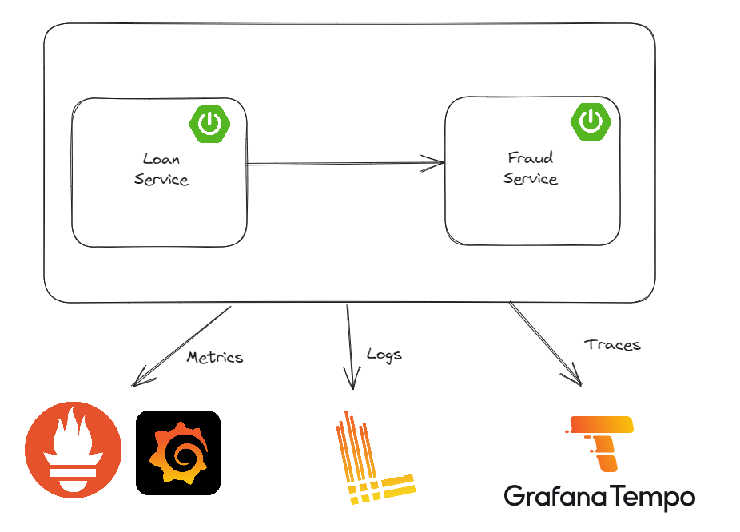

# Spring Boot Observability with Grafana Stack

Two Spring Boot services — `loan-service` and `fraud-detection-service` — instrumented with Micrometer and
wired into the Grafana stack: metrics to Prometheus, traces to Tempo (Zipkin protocol), logs to Loki, all
dashboarded in Grafana.

## Requirements

| | |
|---|---|
| JDK | **25** (`java.version` is `25` in every module; bytecode is class-file major version 69) |
| Spring Boot | 4.1.1 |
| Build | Maven — use the bundled wrapper `./mvnw` |
| Runtime deps | Docker + Docker Compose (MySQL and the Grafana stack) |
| Grafana | 12.4.11 — Angular panels were removed in Grafana 12, see [#103](../../issues/103) |
| Tests | Testcontainers 2.x — needs a running Docker daemon |

Point `JAVA_HOME` at a JDK 25 install before building, e.g.:

```bash
export JAVA_HOME=$(/usr/libexec/java_home -v 25)   # macOS
java -version                                      # should report 25.x
```

## Running the project

Start the infrastructure (MySQL, Tempo, Loki, Prometheus, Grafana):

```bash
docker compose up -d
```

Then run each service. From the repository root:

```bash
./mvnw -pl loan-service spring-boot:run
./mvnw -pl fraud-detection-service spring-boot:run
```

Or build once and run the jars:

```bash
./mvnw clean package
java -jar loan-service/target/loan-service-0.0.1-SNAPSHOT.jar
java -jar fraud-detection-service/target/fraud-detection-service-0.0.1-SNAPSHOT.jar
```

Both services run Flyway migrations on startup, so MySQL must be up first.

## Building and testing

```bash
./mvnw clean verify        # compile + run the Testcontainers integration tests
./mvnw clean package -DskipTests
```

The tests start their own MySQL containers via Testcontainers, so Docker must be running — they do **not**
use the `docker compose` MySQL.

## Accessing the services

| Service | URL |
|---|---|
| Grafana | http://localhost:3000 (log in with `admin` / `admin`, or your `.env` values) |
| Prometheus | http://localhost:9090 |
| Loki | http://localhost:3100 |
| Tempo | in-network only — Grafana reaches it at `http://tempo:3200`; the Zipkin ingest port is http://localhost:9411 |
| MySQL | `localhost:33081` (user `yu71` / password `53cret`) |
| Loan Service | http://localhost:8080 |
| Fraud Detection Service | http://localhost:8081 |

### Endpoints

```bash
# List loans
curl http://localhost:8080/api/loans

# Apply for a loan (calls fraud-detection-service behind the scenes)
curl -X POST http://localhost:8080/api/loans \
  -H 'Content-Type: application/json' \
  -d '{"customerName":"Yuji","customerId":101,"amount":1500}'

# Fraud check, called directly
curl "http://localhost:8081/api/frauds/check?customerId=105"

# Actuator
curl http://localhost:8080/actuator/health
curl http://localhost:8080/actuator/prometheus
```

## Observability

* **Metrics** — each service exposes `/actuator/prometheus`; Prometheus scrapes both via
  `host.docker.internal` (see `docker/prometheus/prometheus.yml`).
* **Traces** — Micrometer Tracing with the Brave bridge, reported over the Zipkin protocol to Tempo on
  port 9411. Sampling is set to 1.0, and the trace ID propagates from `loan-service` into
  `fraud-detection-service` on the outgoing `RestTemplate` call.
* **Logs** — Loki4j pushes to `http://localhost:3100/loki/api/v1/push` with the labels `application`,
  `host` and `level`. Every line carries `[application,traceId,spanId]` via
  `logging.pattern.correlation`, so a trace in Tempo can be pivoted to its logs in Loki.
* **Dashboards** — the *Spring Boot Statistics* dashboard is provisioned from
  `docker/grafana/dashboards/`, so it is present on first start with no manual
  import. Datasources come from `docker/grafana/provisioning/datasources/`, and
  Prometheus is pinned to `uid: prometheus` so the dashboard's panels resolve
  against it on a fresh container.

```
docker/grafana/
├── provisioning/
│   ├── datasources/datasource.yml   # Prometheus, Tempo, Loki
│   └── dashboards/dashboards.yml    # file provider -> /var/lib/grafana/dashboards
└── dashboards/dashboard.json        # Spring Boot Statistics
```

## Configuration

Copy `.env.example` to `.env` and edit it; `docker compose` picks it up
automatically. `.env` is git-ignored, so real credentials never get committed.

```bash
cp .env.example .env
docker compose up -d
```

| Variable | Default | Purpose |
|---|---|---|
| `GF_SECURITY_ADMIN_USER` | `admin` | Grafana admin username |
| `GF_SECURITY_ADMIN_PASSWORD` | `admin` | Grafana admin password |
| `GF_SERVER_ROOT_URL` | `http://localhost:3000` | Public URL Grafana builds share and alert links from |

The two Grafana credentials apply **on first start only** — Grafana stores users
in its own database, so editing `.env` afterwards changes nothing for an
existing install. To change the password later:

```bash
docker compose exec grafana grafana-cli admin reset-admin-password '<new-password>'
```

Anonymous Admin access is not enabled: Grafana requires a real login, which is
what makes it safe to put behind a public hostname.

## Deploying behind nginx

`docker/nginx/jvm.my.id.conf` is a ready-to-install reverse proxy config that
puts the two services and the Grafana dashboard on the `jvm.my.id` domain over TLS:

| Host | Proxies to | Service |
|---|---|---|
| `loan.jvm.my.id` | `127.0.0.1:8080` | loan-service |
| `fraud.jvm.my.id` | `127.0.0.1:8081` | fraud-detection-service |
| `grafana.jvm.my.id` | `127.0.0.1:3000` | Grafana |

Port 80 serves the ACME challenge and redirects everything else to HTTPS.

Grafana requires a real login — set `GF_SECURITY_ADMIN_USER` and
`GF_SECURITY_ADMIN_PASSWORD` in `.env` before exposing it (see
[Configuration](#configuration)). For a second layer in front, the config
carries commented `auth_basic` and IP-allowlist blocks.

### Install

```bash
sudo cp docker/nginx/jvm.my.id.conf /etc/nginx/sites-available/jvm.my.id.conf
sudo ln -s /etc/nginx/sites-available/jvm.my.id.conf /etc/nginx/sites-enabled/
sudo nginx -t && sudo systemctl reload nginx
```

### DNS

```
loan.jvm.my.id      A   <server-ip>
fraud.jvm.my.id     A   <server-ip>
grafana.jvm.my.id   A   <server-ip>
```

### Certificates

```bash
sudo mkdir -p /var/www/certbot
sudo certbot certonly --webroot -w /var/www/certbot \
     -d loan.jvm.my.id -d fraud.jvm.my.id -d grafana.jvm.my.id
sudo systemctl reload nginx
```

Issue the certificates with only the port 80 block enabled, so the challenge
can be served. Renewal is handled by certbot's own timer — check it with
`systemctl list-timers | grep certbot`.

### Notes

* **`/actuator/` is restricted to loopback** on both service hosts. `/actuator/prometheus`
  publishes JVM internals, HikariCP pool state and every URI the app has served.
  Prometheus scrapes the JVMs directly on `:8080` and `:8081` rather than through
  nginx, so nothing depends on it being publicly reachable. Widen the `allow`
  rules in the config if you scrape from another host.
* **Both services set `server.forward-headers-strategy=framework`**, without which
  Spring Boot ignores the `X-Forwarded-*` headers nginx sends and treats every
  request as plain `http` from `127.0.0.1` — generating wrong-scheme URLs and
  logging the proxy as the client.
* **`http2 on;` needs nginx ≥ 1.25.1.** On older builds (Ubuntu 20.04 ships 1.18)
  remove those lines and use `listen 443 ssl http2;` instead.
* **fraud-detection-service does not need to be public.** loan-service reaches it
  over loopback on `:8081`; the config exposes it for convenience, and the
  location block carries a commented allowlist to close it off again.
* A `limit_req` zone is defined but not applied, so the file is safe to install
  as-is. Uncomment the `limit_req` lines to switch on rate limiting.
* **Set `GF_SERVER_ROOT_URL` when proxying**, or Grafana builds share and alert
  links against `http://localhost:3000`. Put it in `.env`, or pass it inline:
  ```bash
  GF_SERVER_ROOT_URL=https://grafana.jvm.my.id docker compose up -d
  ```
* **Grafana Live has its own `location` block** for the `/api/live/ws` WebSocket,
  with buffering off and long timeouts. Without it live panels silently stall.
  `X-Frame-Options` is deliberately not set on the Grafana host, since `DENY`
  would break embedded panel iframes.

## Project Overview


